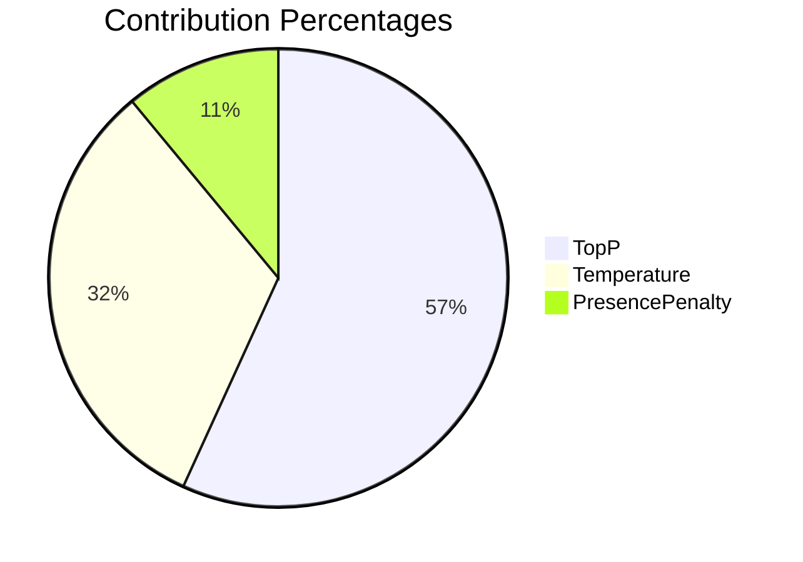
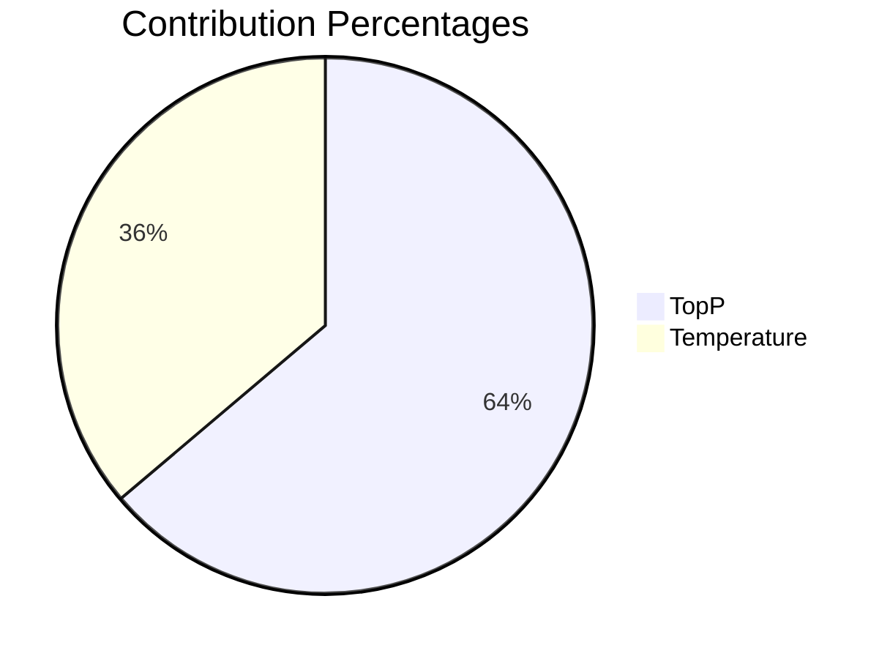
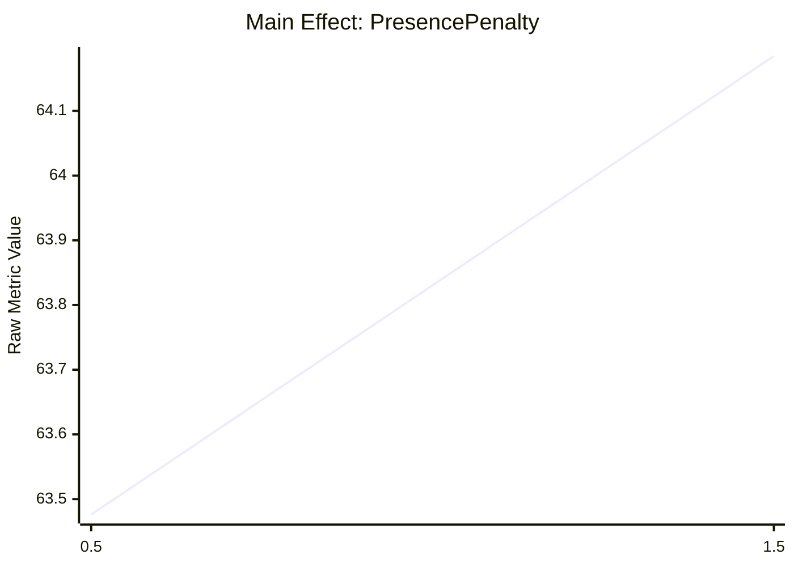
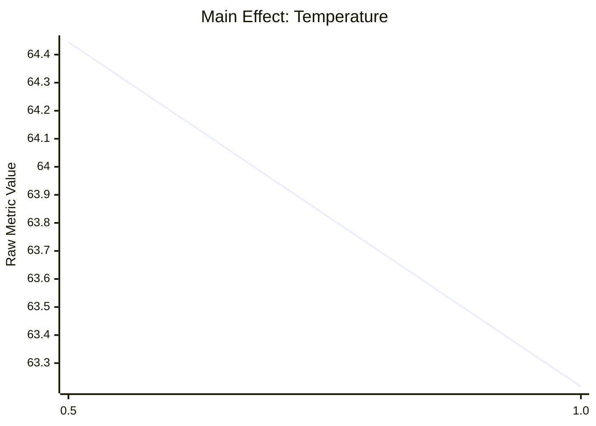
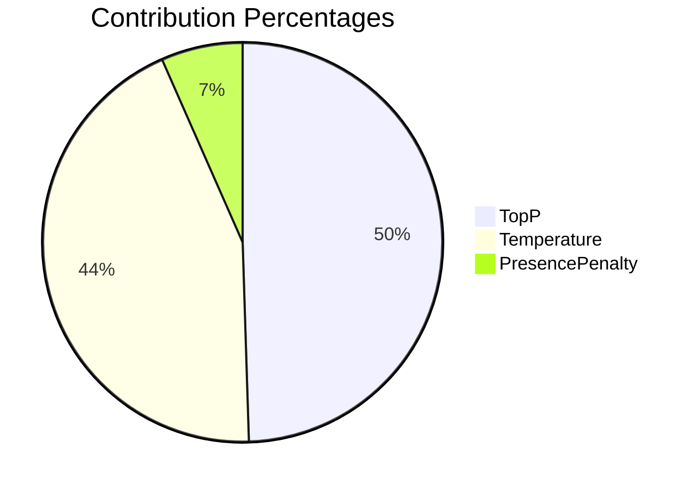
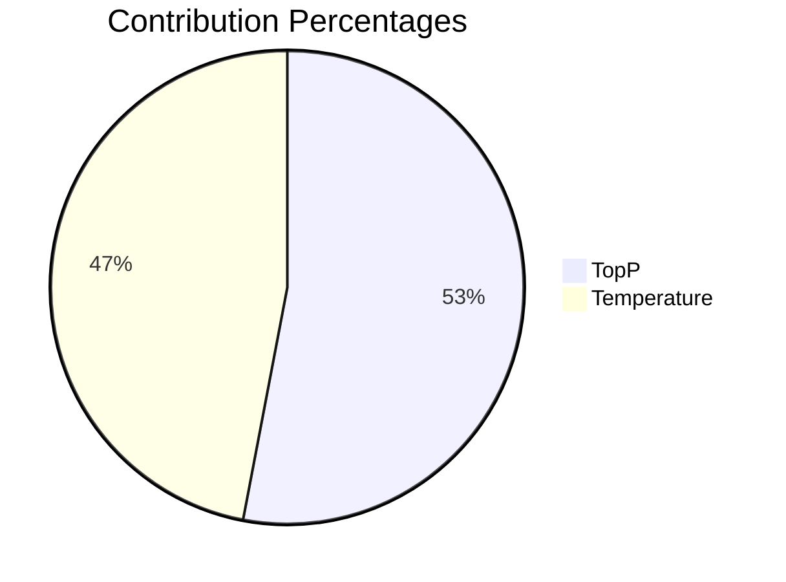
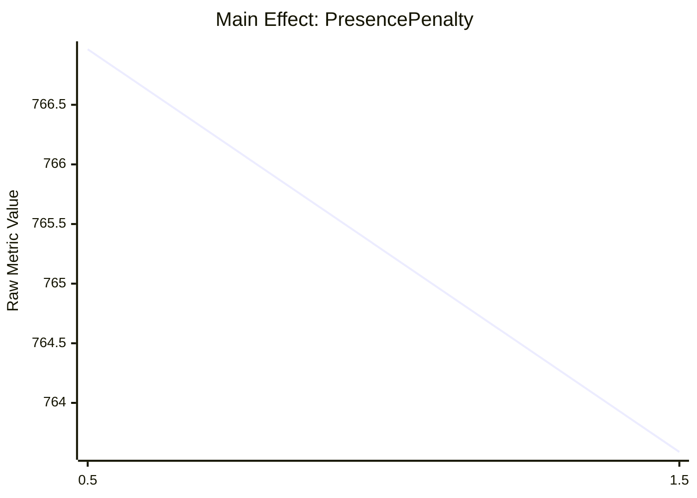
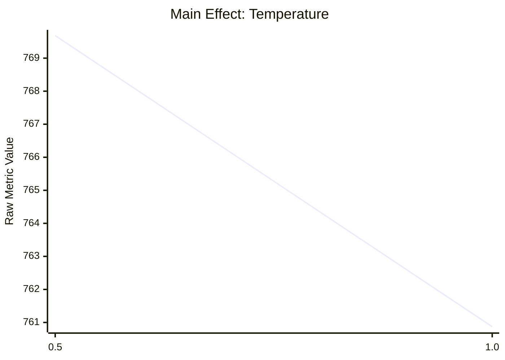
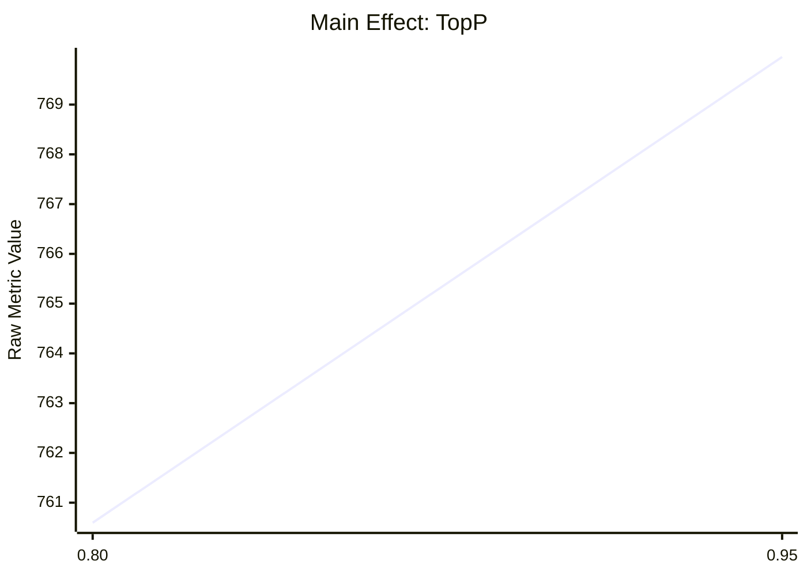

# TaguchiBench Engine Analysis Report

*   **Target Executable:** `dotnet`
*   **Generated:** 2025-05-18 22:18:24 -05:00, **Engine Version:** 1.0.0
*   **Companion HTML Report:** [`dotnet_20250518-195319_TaguchiAnalysisReport.html`](./dotnet_20250518-195319_TaguchiAnalysisReport.html)

## Experiment Configuration Summary
*   **Repetitions per OA Run:** 1
*   **Output Directory:** `./results`
*   **Verbose Engine Logging:** True
*   **Show Target Output:** True
*   **Orthogonal Array Used:** L4

### Metrics Configured for Analysis (2):
*   **AverageScore**: Method = `LargerIsBetter`
*   **Time**: Method = `SmallerIsBetter`

### Control Factors Optimized (3):
*   **PresencePenalty**: CLI=`--presence-penalty`, Levels = ['0.5', '1.5']
*   **Temperature**: CLI=`--temp`, Levels = ['0.5', '1.0']
*   **TopP**: CLI=`--top-p`, Levels = ['0.80', '0.95']

### Fixed Command Line:
```
dotnet
run
--project src/TaguchiBench.LiveBenchRunner
--livebench-scripts-path /path/to/livebench/livebench
--llama-server-exe /usr/bin/llama-server
--llama-model /models/Qwen3-30B-A3B-128K-UD-Q5_K_XL.gguf
--model-name optimized-model
--lb-bench-name live_bench
--lb-release 2024-11-25
--lb-num-questions 10
--lb-parallel 10
--lb-max-tokens 4096
--lb-system-prompt /no_think You are an advanced Software Development AI. It is your purpose to create elegant, modular, type safe, and composable solutions. Adhere strictly to your instructions.
--llama-host 127.0.0.1
--llama-port 8088
--n-gpu-layers 1000
--flash-attn
--cache-type-k q8_0
--cache-type-v q8_0
--env-CUDA_VISIBLE_DEVICES 0
```

# Analysis for Metric: 'AverageScore'
*   **S/N Ratio Type Used:** `Larger is Better`

#### Analysis Warnings (AverageScore - Initial ANOVA):
*   <span style='color:orange;'>⚠ Saturated Design or Model: Error Degrees of Freedom is 0. F-values and P-values may not be calculable or reliable. Significance tests will be impacted.</span>
*   <span style='color:orange;'>⚠ Error term is invalid (DF=0, MSE=NaN). F-values and P-values cannot be reliably calculated. This might be due to a saturated design or zero error variance.</span>
*   <span style='color:orange;'>⚠ Error DF is ≤ 0. ANOVA F-values and P-values cannot be calculated. Statistical significance is unreliable.</span>
*   <span style='color:orange;'>⚠ Saturated Design: All available degrees of freedom assigned to factors. Consider pooling or a larger design.</span>

#### Analysis Warnings (AverageScore - Pooled ANOVA):
*   <span style='color:orange;'>⚠ No significant factors initially; pooled 'PresencePenalty' (smallest F-value/contribution).</span>

### Optimal Configuration (for 'AverageScore')
```yaml
PresencePenalty: 1.5 # OA Level: 2
Temperature: 0.5 # OA Level: 1
TopP: 0.80 # OA Level: 1
```

### Predicted Performance (for 'AverageScore' at Optimal)
*   **Value:** `63.8212` (Original Scale)
*   **95% CI:** `[59.3805 - 68.5940]`

## Initial ANOVA Results ('AverageScore')

| Factor/Interaction         | Contrib (%) | SS      | DF | MS      | F-Value | p-Value | Significant (α=0.05) |
|----------------------------|-------------|---------|----|---------|---------|---------|----------------------|
| TopP                       |       56.78 |  0.0500 |  1 |  0.0500 |     N/A |     N/A | No                   |
| Temperature                |       32.19 |  0.0284 |  1 |  0.0284 |     N/A |     N/A | No                   |
| PresencePenalty            |       11.03 |  0.0097 |  1 |  0.0097 |     N/A |     N/A | No                   |
| Error                      |        0.00 |  0.0000 |  0 |     N/A |     N/A |     N/A | N/A                  |
| **Total**                  |             |  0.0881 |  3 |         |         |         |                      |

#### Contribution Percentage Visualization



## Pooled ANOVA Results ('AverageScore')
*   *Factors Pooled into Error: `PresencePenalty`*

| Factor/Interaction         | Contrib (%) | SS      | DF | MS      | F-Value | p-Value | Significant (α=0.05) |
|----------------------------|-------------|---------|----|---------|---------|---------|----------------------|
| TopP                       |       56.78 |  0.0500 |  1 |  0.0500 |    5.15 |  0.2643 | No                   |
| Temperature                |       32.19 |  0.0284 |  1 |  0.0284 |    2.92 |  0.3372 | No                   |
| Error (Pooled)             |       11.03 |  0.0097 |  1 |  0.0097 |     N/A |     N/A | N/A                  |
| **Total**                  |             |  0.0881 |  3 |         |         |         |                      |

#### Contribution Percentage Visualization



## Main Effects (for 'AverageScore')
| Parameter                  | Level Value | Avg S/N Ratio | Avg Raw Metric |
|----------------------------|-------------|---------------|----------------|
| `PresencePenalty`          | `0.5      ` |       36.0500 |        63.4761 |
|                            | `1.5      ` |       36.1486 |        64.1848 |
| `Temperature`              | `0.5      ` |       36.1835 |        64.4446 |
|                            | `1.0      ` |       36.0151 |        63.2163 |
| `TopP`                     | `0.80     ` |       36.2111 |        64.6488 |
|                            | `0.95     ` |       35.9875 |        63.0121 |

### Main Effect Chart: PresencePenalty




### Main Effect Chart: Temperature




### Main Effect Chart: TopP

```mermaid
xychart-beta
    title "Main Effect: TopP"
    x-axis ["0.80", "0.95"]
    y-axis "Raw Metric Value"
    line [64.6488, 63.0121]
```


### Effect Estimates (S/N Scale - for 'AverageScore')
| Source                     | Effect Est. | Abs(Effect) |
|----------------------------|-------------|-------------|
| `TopP                      ` |     -0.2237 |      0.2237 |
| `Temperature               ` |     -0.1684 |      0.1684 |
| `PresencePenalty           ` |      0.0986 |      0.0986 |

# Analysis for Metric: 'Time'
*   **S/N Ratio Type Used:** `Smaller is Better`

#### Analysis Warnings (Time - Initial ANOVA):
*   <span style='color:orange;'>⚠ Saturated Design or Model: Error Degrees of Freedom is 0. F-values and P-values may not be calculable or reliable. Significance tests will be impacted.</span>
*   <span style='color:orange;'>⚠ Error term is invalid (DF=0, MSE=NaN). F-values and P-values cannot be reliably calculated. This might be due to a saturated design or zero error variance.</span>
*   <span style='color:orange;'>⚠ Error DF is ≤ 0. ANOVA F-values and P-values cannot be calculated. Statistical significance is unreliable.</span>
*   <span style='color:orange;'>⚠ Saturated Design: All available degrees of freedom assigned to factors. Consider pooling or a larger design.</span>

#### Analysis Warnings (Time - Pooled ANOVA):
*   <span style='color:orange;'>⚠ No significant factors initially; pooled 'PresencePenalty' (smallest F-value/contribution).</span>

### Optimal Configuration (for 'Time')
```yaml
PresencePenalty: 1.5 # OA Level: 2
Temperature: 1.0 # OA Level: 2
TopP: 0.80 # OA Level: 1
```

### Predicted Performance (for 'Time' at Optimal)
*   **Value:** `765.2483` (Original Scale)
*   **95% CI:** `[787.3618 - 743.7558]`

## Initial ANOVA Results ('Time')

| Factor/Interaction         | Contrib (%) | SS      | DF | MS      | F-Value | p-Value | Significant (α=0.05) |
|----------------------------|-------------|---------|----|---------|---------|---------|----------------------|
| TopP                       |       49.49 |  0.0113 |  1 |  0.0113 |     N/A |     N/A | No                   |
| Temperature                |       43.88 |  0.0100 |  1 |  0.0100 |     N/A |     N/A | No                   |
| PresencePenalty            |        6.62 |  0.0015 |  1 |  0.0015 |     N/A |     N/A | No                   |
| Error                      |        0.00 |  0.0000 |  0 |     N/A |     N/A |     N/A | N/A                  |
| **Total**                  |             |  0.0229 |  3 |         |         |         |                      |

#### Contribution Percentage Visualization



## Pooled ANOVA Results ('Time')
*   *Factors Pooled into Error: `PresencePenalty`*

| Factor/Interaction         | Contrib (%) | SS      | DF | MS      | F-Value | p-Value | Significant (α=0.05) |
|----------------------------|-------------|---------|----|---------|---------|---------|----------------------|
| TopP                       |       49.49 |  0.0113 |  1 |  0.0113 |    7.47 |  0.2233 | No                   |
| Temperature                |       43.88 |  0.0100 |  1 |  0.0100 |    6.62 |  0.2359 | No                   |
| Error (Pooled)             |        6.62 |  0.0015 |  1 |  0.0015 |     N/A |     N/A | N/A                  |
| **Total**                  |             |  0.0229 |  3 |         |         |         |                      |

#### Contribution Percentage Visualization



## Main Effects (for 'Time')
| Parameter                  | Level Value | Avg S/N Ratio | Avg Raw Metric |
|----------------------------|-------------|---------------|----------------|
| `PresencePenalty`          | `0.5      ` |      -57.6955 |       766.9660 |
|                            | `1.5      ` |      -57.6566 |       763.5886 |
| `Temperature`              | `0.5      ` |      -57.7262 |       769.6829 |
|                            | `1.0      ` |      -57.6259 |       760.8717 |
| `TopP`                     | `0.80     ` |      -57.6228 |       760.5971 |
|                            | `0.95     ` |      -57.7293 |       769.9575 |

### Main Effect Chart: PresencePenalty




### Main Effect Chart: Temperature




### Main Effect Chart: TopP




### Effect Estimates (S/N Scale - for 'Time')
| Source                     | Effect Est. | Abs(Effect) |
|----------------------------|-------------|-------------|
| `TopP                      ` |     -0.1065 |      0.1065 |
| `Temperature               ` |      0.1002 |      0.1002 |
| `PresencePenalty           ` |      0.0389 |      0.0389 |

# Experimental Run Details
*Averages over 1 repetition(s) per OA run.*
| OA Run | Configuration | Avg 'AverageScore' | S/N 'AverageScore' | Avg 'Time' | S/N 'Time' | Repetition Details |
|--------|-----------------|-------------------|-------------------|-------------------|-------------------|--------------------|
| 1      | `PresencePenalty: 0.5`; `Temperature: 0.5`; `TopP: 0.80` | 64.9086           | 36.2460           | 766.6914          | -57.6924          | Rep1: AverageScore=64.91, Time=766.69 |
| 2      | `PresencePenalty: 1.5`; `Temperature: 0.5`; `TopP: 0.95` | 63.9806           | 36.1210           | 772.6744          | -57.7599          | Rep1: AverageScore=63.98, Time=772.67 |
| 3      | `PresencePenalty: 1.5`; `Temperature: 1.0`; `TopP: 0.80` | 64.3889           | 36.1762           | 754.5028          | -57.5532          | Rep1: AverageScore=64.39, Time=754.50 |
| 4      | `PresencePenalty: 0.5`; `Temperature: 1.0`; `TopP: 0.95` | 62.0436           | 35.8539           | 767.2405          | -57.6986          | Rep1: AverageScore=62.04, Time=767.24 |
